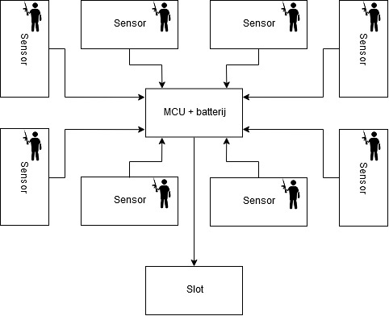
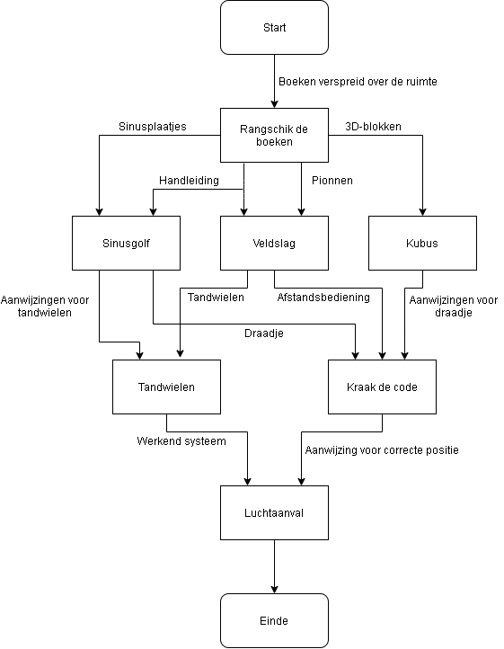

# Het ontwerp

We bespreken hier het ontwerp van onze escape room. Welke stappen we hebben ondernomen en waarop we ons gebaseerd hebben bij het kiezen van thema en puzzels.

We merken op dat om een escape room te maken er heel wat meer bij komt kijken dan gedacht. Men moet rekening houden met de al dan niet extra benodigdheden om een bepaalde puzzel te kunnen uitvoeren, de onderdelen die vrijkomen bij bepaalde puzzels en de complexiteit die bepaalde puzzels met zich meedragen. Ook is het vanzelfsprekend dat niet elke puzzel in elektronica wordt geïmplementeerd. Mechanica speelt een zeer belangrijke rol in puzzels aangezien dit visueel en fysiek vaak meer brengt dan een elektronisch snufje.

We zullen ook spreken over resources. Dit zijn enkele elementen die worden vrijgegeven bij het oplossen van een puzzel en die gebruikt kunnen worden om een andere puzzel op te lossen. Deze resources kunnen in vele vormen voorkomen. Zo bestaan er ontcijfercodes, fysieke elementen om te gebruiken, rekenregels... Het is dus belangrijk dit in gedachten te houden om efficiënt aan een escape room ontwerp te beginnen.

## Thema

Vooraleer we een concept van de puzzels maken, moeten we een thema voor onze escape room zoeken. Na het brainstormen kwamen we uiteindelijk op twee themas uit: "Computervirus" en "Wereldoorlog". Voor beide thema's konden we leuke puzzels vinden die uitdagend genoeg waren om te implementeren in elektronica. Uiteindelijk hebben we besloten om verder te werken met het thema "wereld oorlog" waardoor "The War Project" ontstond. We vonden dat we hiervoor genoeg materiaal hadden om een mooi samenhangend geheel van puzzels te vormen. 

Men kan zich de escape room voorstellen als een hoogtechnologische bunker van waaruit verschillende commando's verstuurd worden. In deze bunker speelt zich dus een tactisch spelletje tegen de klok af. De vijand is naderend en het gevaar schuilt figuurlijk om elke hoek, het is dus belangrijk om elke slag binnen te halen en zo de oorlog te winnen. 

## Puzzels

### Sinusgolf

Men krijgt een sinusgenerator te zien waarvan men via een draaiknop de frequentie kan aanpassen. Ook heeft men enkele plaatjes die men ervoor kan houden en hiermee kan vergelijken. Indien ze de juiste frequenties aan de juiste plaatjes linken, hebben ze de puzzel opgelost. Hiervoor moeten ze aan een draaiknop draaien om de frequentie te veranderen. De resources die ze nodig hebben vooraleer ze aan deze puzzel kunnen beginnen zijn de plaatjes. Men moet hier dus de juiste frequenties linken aan het juiste plaatje (kan gezien worden als vijand/geallieerde) om zo te weten te komen welke golflengte gebruikt wordt door welke eenheden.
### Veldslag

 In het midden van de ruimte staat een tafel die gemaakt is om de plattegrond van de omgeving te schetsen (denk maar aan de tafel in Dragonstone uit Game Of Thrones). Enkele pionnen, gekleurd in blauw en rood, schudderen heen en weer als de bommen neerslaan op enkele tientallen meters van jou vandaan. Waar moet je deze pionnen op het veldslag strategisch plaatsen om de strijd te winnen? Aan de hand van een boodschap of instructie is het mogelijk om de pionnen op de juiste plaats te positioneren waarmee de veldslag kan worden gewonnen en de puzzel dus opgelost is! De resources die men voor deze puzzel nodig heeft zijn de pionnen en de aanwijzingen om ze correct te gaan plaatsen.

### Kraak de code

Natuurlijk is de tegenstander niet dom, ze zullen niet zomaar hun boodschap de wereld insturen. De kans dat deze onderschept wordt, is te groot. Daarom zullen boodschappen geëncrypteerd worden. De code kan gekraakt worden indien men de juiste codering vindt. Dit gebeurt door een draaiende schijf waarop alle mogelijke tekens die gebruikt worden opstaan. Ook heeft men enkele schakelaars, elk teken komt overeen met een bepaalde stand van deze schakelaars. Omdat schakelaars enkel voor 2 toestanden kunnen zorgen, is het zo dat het aantal tekens gelijk is aan 2^(aantal schakelaars). Indien de combinatie samen met de stand van schijf correct zijn, zal er een led gaan branden. Hiermee weet de gebruiker dat een bepaalde codering voor een bepaald teken staat. De stand van de schijf kan veranderd worden door het draaien van een afstandsbediening. De puzzel is opgelost indien de code correct gedecodeerd wordt. Zo kunnen ze de plannen van de tegenstander volledig in de war sturen. De resources die men hier voor nodig heeft zijn de afstandsbediening, de boodschap in codetaal en om nog een extra resource te verkrijgen starten we met een kapotte decoder. Om deze te herstellen hebben we een draadje nodig dat correct aangesloten wordt

### Rangschik de boeken

Deze proef is heel simpel en zal door ons als startproef gebruikt worden. In het lokaal liggen enkele geschiedenisboeken die handelen over belangrijke oorlogsgebeurtenissen. Het is de bedoeling dat deze boeken chronologisch in de boekenkast waar ze perfect inpassen, geplaatst worden. Er staan ook reeds boeken met een bepaald tijdsslot in de boekenkast. Het interval in de tijd waarin ze de boeken mogen plaatsen is dus perfect afgebakend. Aangezien we 1 boek met instructies teveel geplaatst hebben, zal deze hier niet inpassen en dus dienen als instructies om de volgende puzzels op te lossen. In elk boek staan jammer genoeg instructies waardoor de gebruiker correct de boeken in de boekenkast zal moeten plaatsen vooraleer de puzzel opgelost wordt. Ze hebben wel het voordeel dat het instructieboek waarmee ze aan de volgende opdrachten kunnen beginnen al vrijgegeven wordt indien men dit uit de boeken kan filteren. Indien alle boeken correct staan, gaat er een kastje open met nog enkele resources. Deze opdracht heeft dus enkel de boeken die verspreidt liggen in het lokaal nodig als resources en kan veel resources vrijgeven waaronder instructies om volgende puzzels op te lossen.

### Tandwielen

Om deze puzzel op te lossen zal men tandwielen nodig hebben. De tandwielen moeten in juiste posities geplaatst worden om de werking van een systeem te vervolledigen. In onze toepassing kunnen we dit dus makkelijk linken met het defect zijn van het targetting system dat nog moet komen. Ook hier kan eventueel een kastje opengaan om nog extra resources vrij te geven. De tandwielen kunnen opgehangen worden tegen de muur of men kan andere mechanica toepassen om dit te implementeren. Bij deze puzzel is het echter wel nodig om de veiligheid van de gebruiker te garanderen. De resources die men hiervoor nodig heeft, zijn instructies voor een correcte plaatsing en de tandwielen zelf. De resources die men krijgt zijn het gebruik van het targetting system en eventueel nog andere fysieke resources.

### Kubus

De kubus is eigenlijk een zeer kleine puzzel. Het is de bedoeling dat de puzzelaar enkele 3D-blokken krijgt die maar op 1 manier geplaatst kunnen worden zodanig dat deze een kubus vormen. Indien men dit kan verwezenlijken zal men zien dat er een bepaald pad getekend is op de oppervlakte zodanig dat men een connectie kan leggen tussen bepaalde items. Resources die men hiervoor nodig kan hebben zijn de 3D-blokken en eventueel een instructieboekje om te weten te komen wat er exact verwacht wordt. Men krijgt ook de connectie tussen bepaalde items die men ook via trial and error zou kunnen proberen te vinden.

### Luchtaanval

Bij deze puzzel is de bedoeling dat een luchtaanval zo correct mogelijk uitgevoerd wordt. De puzzelaar heeft een interactieve plattegrond van de omgeving voor zich staan, hierop is een aangeduid waar de bom zal landen indien men hem afvuurt. De puzzelaar moet ervoor zorgen dat de bom op de correcte positie terechtkomt om de tegenstander een zo groot mogelijke nederlaag te doen lijden. Hiervoor heeft men instructies nodig om de bom zo correct mogelijk af te vuren. De puzzelaar heeft ook maar enkele kansen omdat deze puzzel als de eindwinst gezien wordt. Het moet normaal gezien mogelijk zijn om de machine te laten werken in de gegeven tijd. De juiste positie vinden is echter iets moeilijker en zal ervoor zorgen dat diegenen die het effectief weten ook de escape room zullen overwinnen. Ook hier is de machine defect waardoor men deze zal moeten repareren. Dit gebeurt door middel van de tandwielen proef. De resources die hiervoor nodig zijn, zijn de aanwijzingen en de reparatie van de machine door middel van de opdracht tandwielen. Door deze proef te vervolledigen haalt men de eindwinst binnen.

## Samenhang
Hieronder ziet u een grafiek waarin getoond staat hoe de puzzels aan elkaar hangen. De vierkantjes zijn de puzzels, de pijltjes zijn resources die vrijgegeven worden door de puzzel van waar de pijl start en nodig zijn voor de puzzel waarnaar het pijltje wijst. We hebben expliciet gekozen om bepaalde resources snel te verkrijgen zodat men op hetzelfde moment over meerdere puzzels zou kunnen nadenken en er dus een betere spreiding is.

## Puzzelkeuze

Door de coronaproblematiek hebben we besloten om minstens 2 puzzels te verwezenlijken. Hierbij viel de keuze natuurlijk op de verwezenlijking van de puzzel in elektronica. De puzzels die hieraan voldoen, zijn de sinusgolf, de veldslag, kraak de code, de rangschikking van boeken en de luchtaanval. Uiteindelijk hebben we gekozen voor de veldslag en de kraak de code puzzels omdat deze puzzels complex genoeg lijken om te verwezenlijken. Nu het escape room ontwerp klaar is, kunnen we beginnen aan het ontwerpen van de elektronica voor elke puzzel apart.

