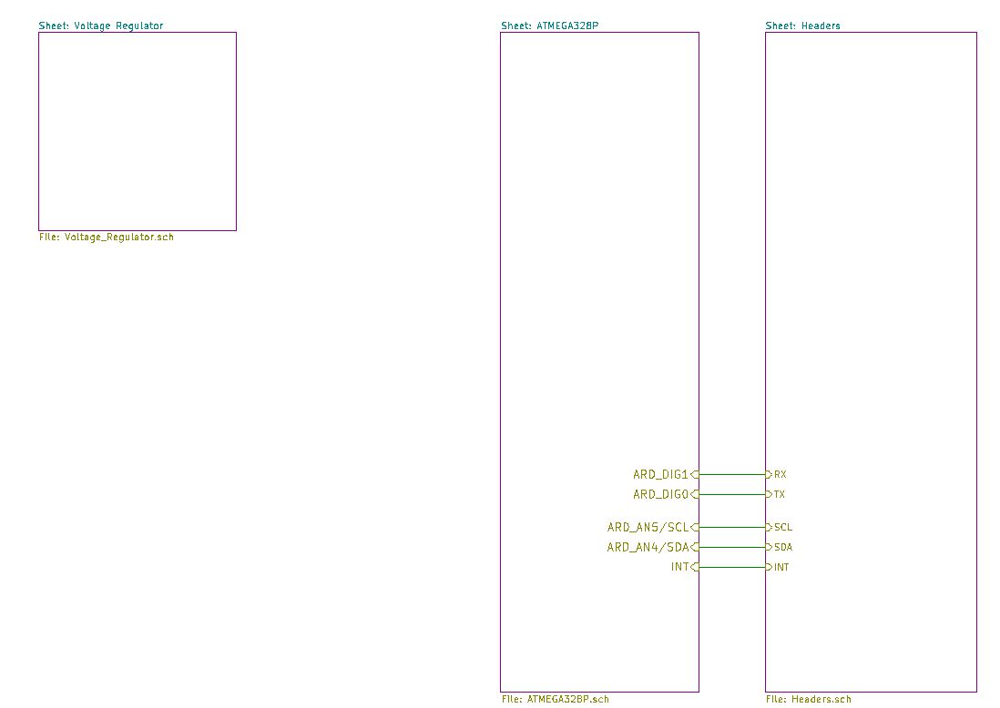
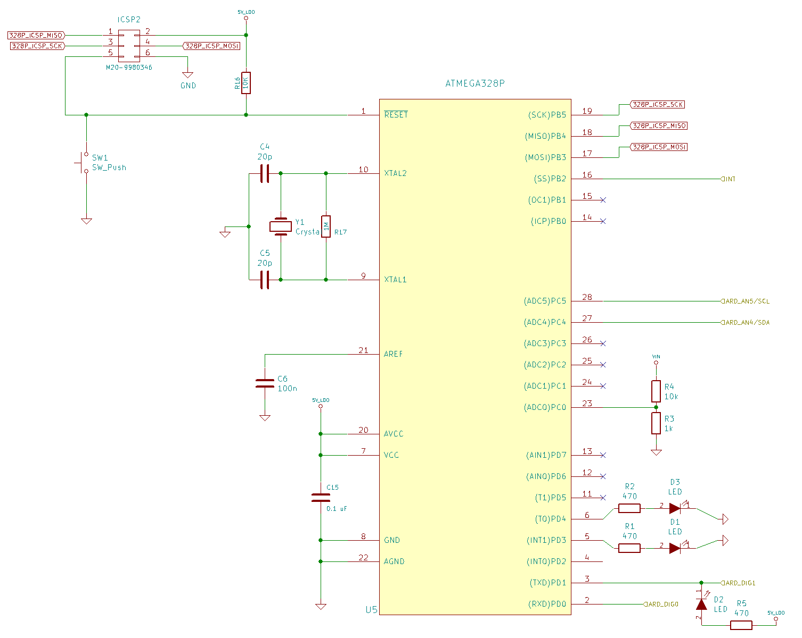
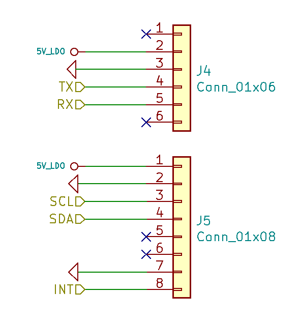
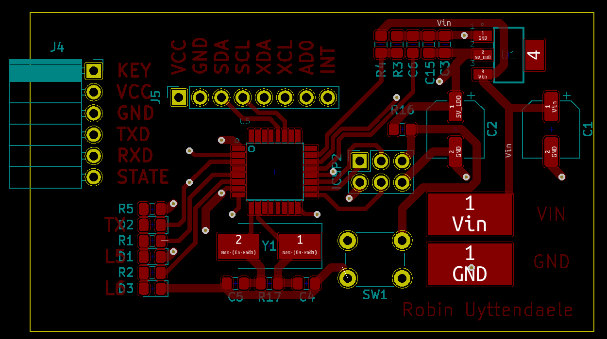
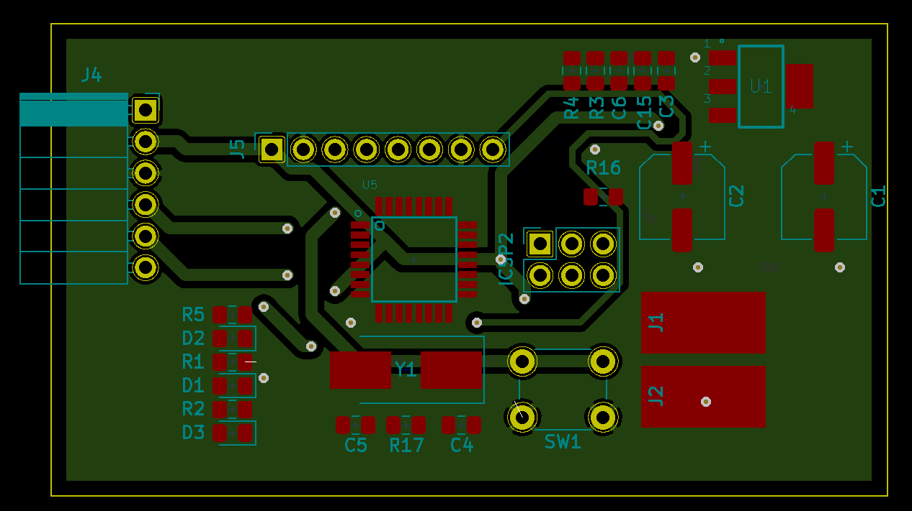

# Ontwerp

Nu we weten welke technologiëen en bijkomend welke specifieke modules we gaan gebruiken kunnen we overgaan tot het maken van het schema. We moeten wel opmerken dat het schema werd gemaakt in combinatie met het schrijven van de code. Het is namelijk niet zinvol om inputs en outputs te gaan verbinden die niet nodig zijn en het is een groter probleem wanneer inputs en outputs die verbonden moeten zijn zodat de code kan werken, niet verbonden zijn. In ons schema hebben we één input verbonden die overbodig is.

Ook zullen we enkel een schema ontwerpen voor onze remote controller. Dit doen we omdat we enkel hiervoor een PCB fysiek zullen maken.

## Schema

We hebben ons schema getekend via KiCad en hebben gebruik gemaakt van een reeds bestaand Arduino schema te vinden op deze [link](https://github.com/rheingoldheavy/arduino_uno_r3_from_scratch). Op dit schema hebben we echter bepaalde dingen weggelaten om onze PCB een zo laag mogelijk verbruik te geven. Het schema dat we zo bekomen ziet u in de volgende figuur.

In deze figuur is de USB-interface samen met de ATMEGA16U2 weggelaten, dit omdat we niet van plan zijn om onze PCB te programmeren via een USB-interface. We zullen de PCB programmeren door gebruik te maken van een andere Arduino die de code zal uploaden via de SPI interface. Ook het voltage management schema is weggelaten, dit omdat we geen spanning van 3.3V nodig hebben. 

Het voltage regulator schema is zo goed als hetzelfde gebleven. Het enige verschil dat we aangebracht hebben is de input jack vervangen door soldeerpunten waar we onze batterij zullen aan solderen.

Aan de ATMega zijn er ook weinig veranderingen gebeurd, we hebben de volledige USB-interface laten vallen en hebben alle digitale en analoge pinnen die we niet gebruiken afgesloten. De pinnen die we wel zullen gebruiken, gaan naar de HC05 en de MPU6050. Ook moeten we er aandacht aan besteden dat de ICSP-pinnen blijven zodat we ons PCB kunnen programmeren. 

We hebben ook 2 ledjes geplaatst aan digitale pin 3 en 4 zodat we kunnen kijken of een simpel programma zoals blink werkt op onze PCB. Indien dit niet het geval is, kunnen we toch al enkele redenen waarom het niet werkt elimineren. Een derde led wordt geplaatst aan de TX-pin zo kunnen we zien wanneer er informatie verzonden wordt via de HC-05 (bluetooth-module).
Als laatste is de analoge pin 0 via een spanningsverdeler rechtstreeks verbonden aan de ingangsspanning. Hiermee zullen we nagaan of het spanning over de batterijen nog groot genoeg is. Indien dit niet het geval is, moeten de batterijen vervangen worden.
Een foto van de ATMega kunt u hieronder zien.

Meer uitleg over de basiscomponenten zoals de ATMega 328P, de LDO voltage regulator LD1117S50TR en het kristal ABLS7M2 kunt u vinden bij het ontwerp van de veldslag. Deze worden hier niet toegevoegd aangezien men ze voor beide PCBs nodig heeft en ze daar reeds uitgelegd zijn.

Als laatste hebben we de het headersheet waarop de 2 headers staan waarmee onze modules verbonden zullen worden. Dit kan men terugvinden in onderstaande figuur.

## Routing

Nu we ons schema gemaakt hebben, moeten we enkel nog de juiste footprints koppelen en routen. We zullen tijdens het routen erop letten dat de ground- en 5V-banen dik genoeg zijn. Dit om te voorkomen dat er slecht contact zou ontstaan en de volledige toepassing hierdoor niet werkt. De frontview kunt u hieronder zien.

We hebben ook enkele banen op de achterkant getrokken. In combinatie met een grondvlak krijgen we de figuur hieronder.

