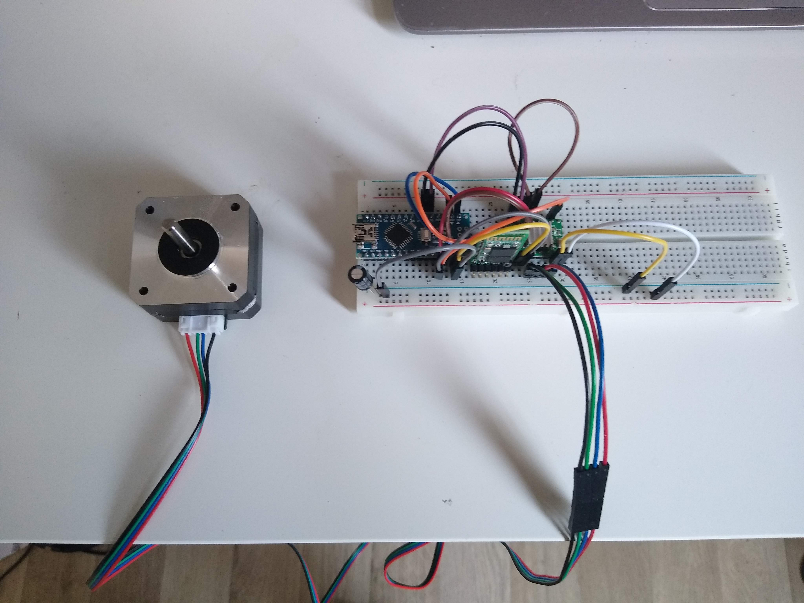

# Realisatie

Hieronder staat een foto van de decoder als PCB. Hier hangt de batterij nog niet aan. Maar kan er snel en gemakkelijk aan gesoldeerd worden.

We hebben ook nog de decoder. Deze staat op een breadboard aangezien we hier geen PCB van gemaakt hebben. Deze mist ook nog een externe stroombron om de motor te laten draaien en hierin zijn de schakelaars en de LED niet geïmplementeerd.  

Beide modules werken zoals het hoort en ook de bluetooth modules doen wat hun gevraagd werd. Nu is de vraag alleen nog maar of het grote geheel ook werkt. Er resteert ons enkel nog maar om de code in te laden op beide microcontrollers.

Het inladen op de PCB ging moeilijker dan gedacht en we kunnen de bootloader niet branden, hierdoor is het onmogelijk om de code te laten draaien op de ATMega. We kregen dezelfde foutmelding zoals het PCB van de veldslag kreeg. Jammer genoeg kunnen we dus niet testen of ons zelf ontworpen PCB werkt.

Daarom heb ik een remote controller van een Arduino Uno gemaakt. Eerst laad ik de code in via een USB-kabel, zodat deze in het EEPROM-geheugen van de ATMega staat. Hierna verbinden we de batterij met de VINpin en de GNDpin. Hierdoor gaat het ON-ledje van de Arduino branden. De HC05-module kunnen we aan de UART-periferie (Tx & Rx) hangen. Hierbij moeten we opletten dat we TXD aan Rx verbinden en RXD aan Tx. Om deze module te voeden, kunnen we de 5V- en de GND-pin van de ICSP-pinnen pakken.
Daarna is het de beurt aan de MPU-6050 die we simpelweg aan de overgebleven 5V- en GND-pin kunnen hangen om hem te voeden en aan de I2C-bus (SDA & SCL) te hangen om data door te geven. Hierdoor zijn nu alle connecties gelegd. Het resultaat is hieronder te zien. We moeten er wel op letten dat onze MPU-6050 rechtstaat zodat we een een correct beeld kunnen schetsen van de werking.

Indien we de schakelaars zullen toevoegen aan de decoder, loopt er iets grondig mis. De delay wordt groter waardoor de responstijd zeer lang is. Dit komt omdat de Arduino op sommige momenten meer werk moet doen dan hij aankan. Dit kan gebeuren indien de remote controller informatie doorstuurt en de schakelaars op hetzelfde moment veranderd worden.