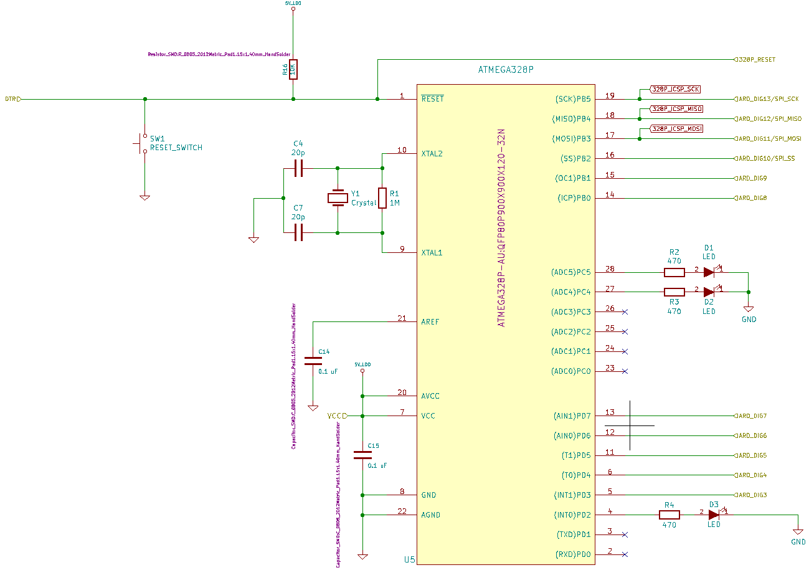

# Ontwerp

## Code

De code voor de RFID puzzel is [hier](../Code/RFIDcode.md) te vinden. Bovenaan de code vinden we enkele includes terug die de juiste libraries inladen en die doorheen de code zullen gebruikt worden. Vervolgens vinden we enkele declaraties van constanten en pinnen terug. Een boolean *isLocked* zal false worden zodra de juiste combinatie van RFID tags en sensoren gevonden is. Als laatste maken we drie arrays aan. Één die de pinnen van de sensoren bijhoudt, één die de ID tags van de toegelaten ID tags bijhoudt en eentje die de sensoren van de puzzel in een array bijhoudt.

Het tweede gedeelte van de code bestaat uit de setup. Hier wordt alles geïnitialiseerd. We starten met het connecteren van de seriële monitor en printen hierop een tekstje uit. Vanaf dan zal voor het aantal readers, in ons geval 8, telkens gecontrolleerd worden of deze werken. Indien ze werken zullen hun naam en firmware version in de seriële monitor verschijnen. 

Na declaraties en initialisaties komen we uit op de kern van het programma. Bovenaan de loop vinden we voorwaarde *isLocked* terug die hierboven vermeld en uitgelegd is. Voor elke poging tot het juist plaatsen van de tags houden we een array bij die de ingelezen tags in volgorde bijhoudt. De code start nu met het lezen van wat er aan elke sensor hangt. Hangt er een ID tag aan de sensor, dan wordt deze opgeslagen in de array *readNfcTags*. Indien er niets tegen de sensor hangt dan blijft de waarde op 0 staan. Na het overlopen van elke sensor wordt de array *readNfcTags* met de array *NFC_ACCEPTED_TAGS* vergeleken. De variabele *countOfMatchingTags* wordt verhoogt met 1 indien de respectievelijke waarden in de kolommen van de arrays overeenkomen. Als *countOfMatchingTags* even groot is als het aantal sensoren dat we gebruiken dan betekent dit dat de tags overeen komen en de puzzel opgelost is. *isLocked* wordt nu false en het slot gaat open.

## PCB design

Het PCB design werd gemaakt via kiCAD. Dit is een free open source EDA die gemakkelijk te gebruiken is; zelfs voor maken van uw eerste PCB!

Vooraleer we kunnen routen, moeten we een schema opstellen. Als startpositie voor dit schema hebben we gebruik gemaakt van een al reeds bestaand schema terug te vinden via volgende [link](https://github.com/rheingoldheavy/arduino_uno_r3_from_scratch). 

De afbeelding hierboven is de top view van onze PCB. We zullen op elk van deze componten ons eens verdiepen, startende met de voltage regulator te zien in de afbeelding hieronder.

Om onze PCB te voeden hebben we twee soldering pads, genaamd B+1 en B-1, aangesloten op de LDO. De gebruikte LDO LD1117S50TR is een standaard, veel gebruikte LDO perfect geschikt voor de puzzel. Als ontkoppelings capaciteiten hebben we de MLCC capaciteiten gekozen voor hun kleine effectieve serie resistentie en inductantie. Ze hebben ook een breed temperatuursbereik dat in escape rooms handig kan zijn aangezien het warm kan worden in zo'n kamers. De LDO zal een 5V spanning leveren die we gebruiken als output alsook om de microcontroller van spanning te voorzien.

Het schema van de atmega 328P is terug te vinden in de afbeelding hierboven. Link bovenaan is de reset pin terug te vinden. Deze is verbonden met de spanning aangezien deze op basis van active low werkt. De knop om de arduino te resetten wordt dan verbonden met de grond. Om de atmega een werk frequentie te geven hebben we nood aan het kristal X1. De capaciteiten zorgen ervoor dat we een oscillator maken. De weerstand daarentegen is nodig om de oscillator betrouwbaar op te starten.