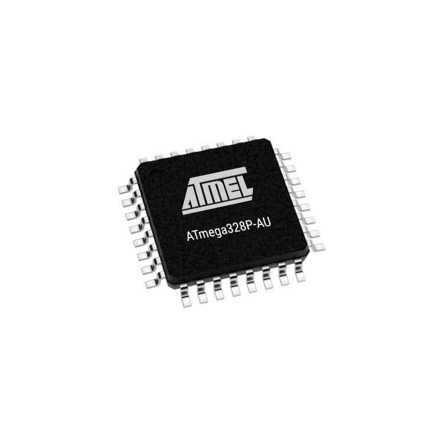
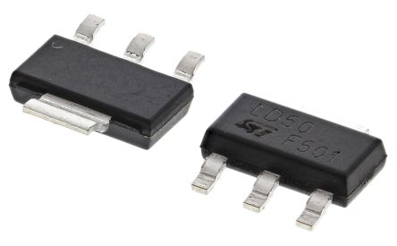

# Analyse

## Technologieën

Om de pionnen te detecteren is er nood aan een sensor. Tijdens het opzoeken van technologieën kwamen we uit op twee verschillende mogelijkheden. We zouden gebruik kunnen maken van het hall effect of gebruik van RFID modules. Hieronder zullen beiden vergelijkt en onderzocht worden om zo tot een keuze te komen voor de veldslag puzzel.

### Hall effect

Een eerste mogelijkheid is het gebruik van hall effect sensoren. Wanneer er geen extern magnetisch veld in de buurt van de sensor gebracht wordt, zal de output spanning gelijk zijn aan nul. Indien er toch een extern magnetisch veld in de buurt van de sensor komt zal er meer stroom geleiden wat tot een grotere output spanning zal leiden. 

Om deze technologie te implementeren zouden we gebruik moeten maken van magnetische staven, elk met een verschillende magnetische sterkte. Dit brengt echter enkele problemen met zich mee. 

* Het bestellen van op maat gemaakte magnetische staven zou ten eerste al duur alsook moeilijk te verkrijgen zijn.

* Staven kunnen elkaar beïnvloeden zodat de gemeten magnetische veldsterkte niet overeenkomt met de verwachte waarde. Andere toestellen kunnen ook een magnetisch veld creëren dat groot genoeg is om de resultaten te beïnvloeden.

* Het ontwerp voor de pinnen zal moeilijker zijn. De magnetische staven moeten echter redelijk lang zijn. Het verstoppen van de puzzel zal ook moeilijker worden aangezien er gaten in het spelbord gemaakt moeten worden.

Dit is dus niet geschikt voor een puzzel waar correctheid en verstoppen belangrijk zijn. De RFID technologie voldoet hier wel aan.

### RFID

Radio Frequency Identification (RFID) is het draadloos gebruik van radio frequenties om data te transfereren. 

Uit wat bestaat zo'n systeem dan?

* RFID reader

* RFID tag

* Antenne

Alseerst hebben we een RFID tag nodig. Deze tags bestaan uit een geïntegreerd circuit alsook een antenne om de informatie die ze opgeslagen hebben over te brengen via radio frequenties. De tags kunnen dan ook passief als actief zijn. Actieve tags hebben een voeding waarmee ze opgestart worden maar wij hebben daar geen nood aan. De passieve tags zullen actief worden door een RFID reader dat een signaal stuurt naar de tag zijn antenne. De antenne absorbeerd de energie en zal hierdoor informatie over de tag terug sturen via de antenne. Passive tags zijn ook goedkoper dan actieve tags waardoor ze beter geschikt zijn voor een low cost puzzel.

Naast de tags zijn er natuurlijk ook readers nodig. Zij zullen de informatie van de tags opvragen en lezen. Indien de ID tags (pionnen) overeen komen de juiste readers zal het slot open gaan. Meer informatie is [hier](./Code.html) terug te vinden

% EVERYTHING HAS TO BE DELETED BELOW

## Functionaliteit

Het doel van de puzzel is om de juiste combinaties van ID tags en sensoren te vinden. Om dit te realiseren hebben we nood aan 8 RFID sensoren, een LDO en een atmega328P.

### Onderdelen

Om deze puzzel tot een goed eind te brengen hebben we nood aan enkele onderdelen. Hun belangrijkste kenmerken zullen hieronder beschreven worden.

#### Atmega 328P

De atmega 328P is het hart van onze puzzel. Deze processor, gebruikt in arduino UNO, is gekozen omwille van het wijdverspreid gebruik en de familiariteit in eerdere jaren van onze studie. Enkele gegevens zijn weergegeven in de tabel hieronder. Belanrijk om te noteren is dat er meer dan genoeg flash memory aanwezig is voor onze kleine programmas alsook de operating frequency hoog genoeg ligt zodat we een kristal van 16MHz kunnen gebruiken voor onze toepassing.

| Parameter                      | Value            |
| :---:                          | :---:            |
| Microcontroller                | 8-bit AVR        |
| Flash memory                   | 32 KB            |
| EEPROM                         | 1 KB             |
| SRAM                           | 2 KB             |
| I/O pins                       | 23               | 
| Interface                      | Master/Slave SPI |
| Maximum operating frequency    | 20 MHz           |

#### LD1117S50TR

Om onze processor te voeden hebben we nood aan een LDO. Deze zal de ingangsspanning van de atmega 328P, gegenereerd door de batterijen, op een constante van 5V houden.

| Parameter                            | Value        |
| :---:                                | :---:        |
| Operating junction temperature range | 0 to 125 °C  |
| Max DC input voltage                 | 15 V         |
| Output current                       | Up to 800 mA |

#### PN532 NFC module

De PN532 sensoren zijn uitermate belangrijk voor de werking van de puzzel. Ze kunnen de IDs van Mifare cards of stikkers lezen binnen een bereik van 5 tot 7 cm. De sensoren hebben ook regelbare interfaces zodat we kunnen kiezen tussen SPI, I2C of HSU. We hebben voor ISP gekozen maar dat komt later aan bod. Enkele kenmerken van de sensoren volgen in onderstaande tabel.

| Parameter                 | Value               |
| :---:                     | :---:               |
| On board level shifter    | Present             |
| Interchangable interfaces | ISP, I2C and HSU    |
| Arduino compatible        | Yes                 |
| Reading distance          | 5-7 cm              |
| Supported cards           | Mifare 1K, 4k, etc. |
| Built in antenna          | On board            |

## Gebruikstoepassingen

Deze puzzel is ontworpen om gebruikt te worden in een escape room maar kan zeker ook gebruikt worden in eigen projecten waar iemand een slot nodig heeft aan de hand van verschillender ID tags.

## Vereisten

Aangezien de bekabeling zeer fragile is en de sensoren zeker niet beschadigd mogen worden is het aangeraden om deze niet in contact te laten komen met de gebruiker. Verstop de puzzel dus aan de achterkant van een plaat en vijs de sensoren op de plaat zodat de ID tags nog binnen de 5-7 cm operatie radius komen. Zorg er tenslotte ook voor dat de temperatuur niet onder nul of boven 125 graden stijgt. Indien dit niet gerespecteerd wordt kunnen we de normale werking van de puzzel niet garanderen.