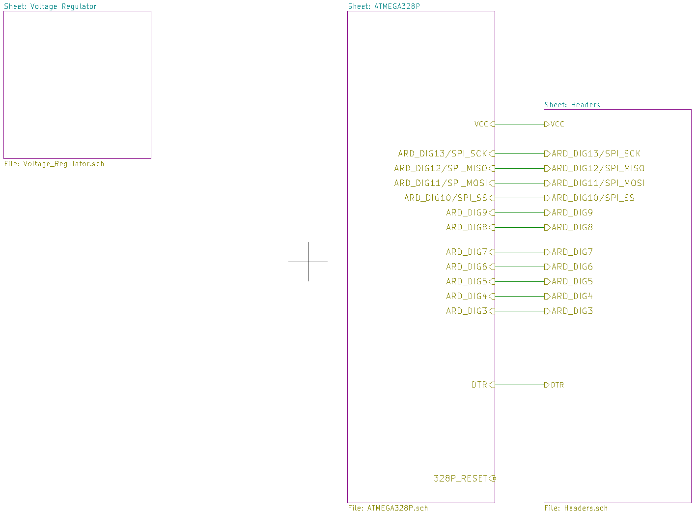
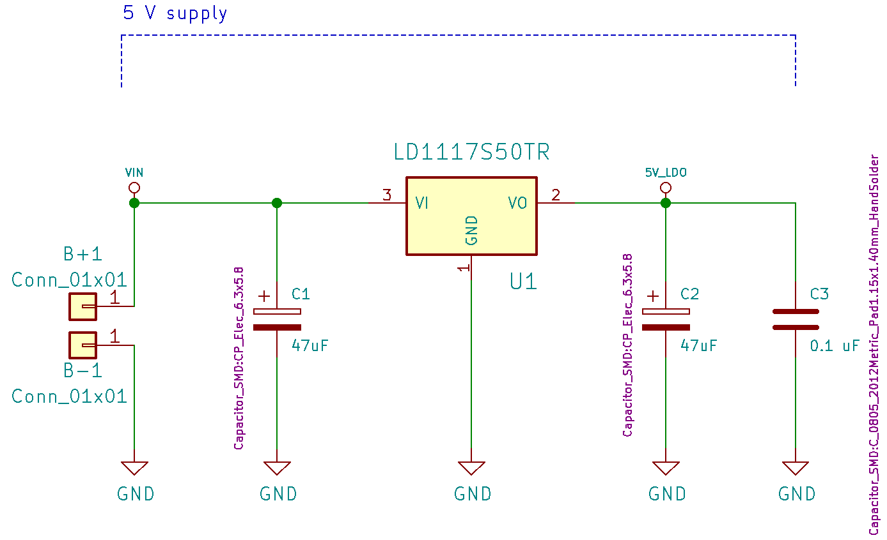

# Ontwerp

Het ontwerp van veldslag moet in verschillende stappen gebeuren. Eerst beginnen we met een schema. Dit zal blok per blok uitgelegd worden zodat de functionaliteit van het geheel duidelijk wordt. Vooraleer we de stap maken naar de routing van de pcb is er nood aan de keuze van footprints. Deze footprints zullen voorgesteld worden door de componenten en hun eigenschappen. Als laatste zullen we eens kijken naar het eigenlijke routen zelf.

Het PCB design werd gemaakt via kiCAD. Dit is een free open source EDA die gemakkelijk te gebruiken is.

## Schema

Vooraleer we kunnen routen, moeten we een schema opstellen. Als startpositie voor dit schema hebben we gebruik gemaakt van een al reeds bestaand schema terug te vinden via volgende [link](https://github.com/rheingoldheavy/arduino_uno_r3_from_scratch). 

De afbeelding hierboven is de top view van onze PCB. We verdiepen ons nu in elk van deze componten, startende met de voltage regulator te zien in de afbeelding hieronder.

Om onze PCB te voeden hebben we twee soldeerpads, genaamd B+1 en B-1, aangesloten op de LDO. De gebruikte LDO LD1117S50TR is een standaard, veel gebruikte LDO perfect geschikt voor de puzzel. Als ontkoppelings capaciteiten hebben we de MLCC capaciteiten gekozen voor hun kleine effectieve serie resistentie en inductantie. Ze hebben ook een breed temperatuursbereik dat in escape rooms handig kan zijn aangezien de temperatuur daar soms kan oplopen. De LDO zal een 5V spanning leveren die we gebruiken als output alsook om de microcontroller van spanning te voorzien.

Het schema van de atmega 328P is terug te vinden in de afbeelding hierboven. Links bovenaan is de reset pin terug te vinden. Deze is verbonden met de spanning aangezien deze op basis van actief laag werkt. De knop om de arduino te resetten wordt dan verbonden met de grond. Om de atmega een werk frequentie te geven hebben we nood aan het kristal X1. De capaciteiten zorgen ervoor dat we een oscillator maken. De weerstand daarentegen is nodig om de oscillator betrouwbaar op te starten. Links onderaan vinden je nog enkele pinnen die naar de grond of met de voeding worden verbonden. De rechter kant van de atmega 328P bevat de nodige pinnen voor de sensoren. Naast de sensoren gebruiken we ook enkele leds om de toestand van het slot weer te geven. 

Als laatste bekijken we de headers. We hebben nood aan 8 headers elk met een voeding, grond, slave select, miso, mosi en clock pin. Er is ook een pin voorzien om met de reset te connecteren.

## Componenten

Enkele componenten komen nu aan bod. Aan de hand van deze componenten werden de footprints gekozen om hiermee te kunnen routen.

### Atmega 328P-AU

De atmega 328P is het hart van onze puzzel. Deze processor, gebruikt in arduino UNO, is gekozen omwille van het wijdverspreid gebruik en de familiariteit in eerdere jaren van onze studie. Enkele gegevens zijn weergegeven in de tabel hieronder. Belangrijk om te noteren is dat er meer dan genoeg flash memory aanwezig is voor onze kleine programma's. De maximum operatie frequentie ligt hoog genoeg zodat we het kristal ABLS7M2, hierna besproken, kunnen gebruiken.

| Parameter                      | Value            |
| :---:                          | :---:            |
| Microcontroller                | 8-bit AVR        |
| Flash memory                   | 32 KB            |
| EEPROM                         | 1 KB             |
| SRAM                           | 2 KB             |
| I/O pins                       | 23               | 
| Interface                      | Master/Slave SPI |
| Maximum operating frequency    | 20 MHz           |

### LD1117S50TR

Om onze processor te voeden hebben we nood aan een LDO. Deze zal de ingangsspanning van de atmega 328P, gegenereerd door de batterijen, op een constante van 5V houden.

| Parameter                            | Value        |
| :---:                                | :---:        |
| Operating junction temperature range | 0 to 125 °C  |
| Max DC input voltage                 | 15 V         |
| Output current                       | Up to 800 mA |

### ABLS7M2

Aan de processor wordt een kristal gehangen om deze van een werkfrequentie te voorzien. Dit kristal heeft een groot bereik aan standaard frequenties, perfect voor onze ATMEGA 328P die een maximum werkfrequentie heeft van 20MHz.

| Parameter                  | Value        |
| :---:                      | :---:        |
| Low profile                | 2mm max height |
| High reliability           | 15 V         |
| Extended temperature range | Up to 800 mA |

## Routing

In de bovenstaande afbeelding is de PCB gerouteerd. De 5V lijnen zijn dikker gemaakt zodat de stroom er zeker door zou vloeien. Daarnaast moeten de ontkoppel capaciteiten zo dicht mogelijk bij de componenten liggen. Als laatste is er ook een grond vlak aan de onderzijde van de PCB voorzien om gemakkelijker de gronden met elkaar te verbinden. De uiteindelijke oppervlakte van de PCB is 50.40mm op 38.00mm. 

