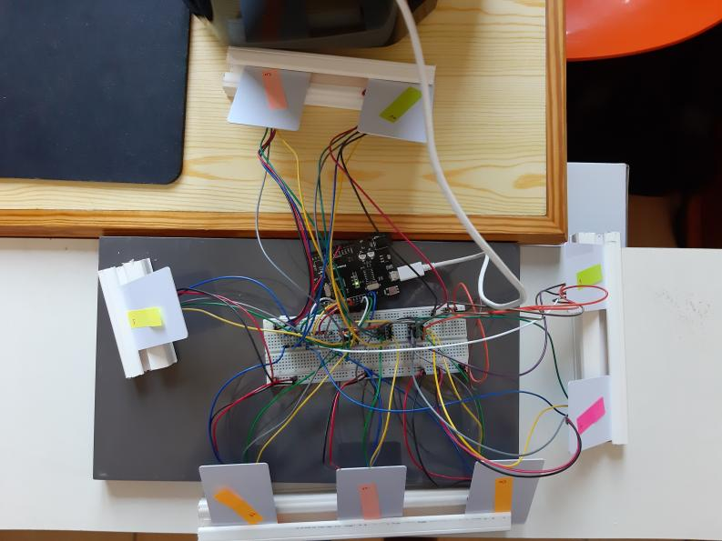
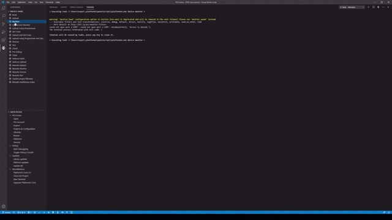

# Realisatie



In bovenstaande figuur is een eerste prototype weergegeven. Hier werd gebruik gemaakt van een breadboard om de MISO, MOSI en SCK pinnen te verdelen over al de sensoren.  De sensoren staan op een redelijke afstand van elkaar zodat ze elkaar niet beïnvloeden. Door gebrek aan houten platen zijn de sensoren in latten vergrendelt samen met de ID tags. Hieronder zijn twee filmpjes terug te vinden van dit prototype. Op een filmpje worden de ID tags op de sensoren geplaatst waardoor in het andere filmpje te zien is dat telkens er een nieuwe tag bij komt, de sensor zijn ID weergeeft in de monitor. Als alle ID tags op hun plaats staan is het slot ontgrendeld. 




Bij het tweede prototype is echter iets mis gelopen. Tijdens het branden van de bootloader kregen we het volgende te zien.

```
avrdude: Version 6.3-20190619
         Copyright (c) 2000-2005 Brian Dean, http://www.bdmicro.com/
         Copyright (c) 2007-2014 Joerg Wunsch

         System wide configuration file is "C:\Program Files\WindowsApps\ArduinoLLC.ArduinoIDE_1.8.33.0_x86__mdqgnx93n4wtt\hardware\tools\avr/etc/avrdude.conf"

         Using Port                    : COM6
         Using Programmer              : stk500v1
         Overriding Baud Rate          : 19200
         AVR Part                      : ATmega328P
         Chip Erase delay              : 9000 us
         PAGEL                         : PD7
         BS2                           : PC2
         RESET disposition             : dedicated
         RETRY pulse                   : SCK
         serial program mode           : yes
         parallel program mode         : yes
         Timeout                       : 200
         StabDelay                     : 100
         CmdexeDelay                   : 25
         SyncLoops                     : 32
         ByteDelay                     : 0
         PollIndex                     : 3
         PollValue                     : 0x53
         Memory Detail                 :

                                  Block Poll               Page                       Polled
           Memory Type Mode Delay Size  Indx Paged  Size   Size #Pages MinW  MaxW   ReadBack
           ----------- ---- ----- ----- ---- ------ ------ ---- ------ ----- ----- ---------
           eeprom        65    20     4    0 no       1024    4      0  3600  3600 0xff 0xff
           flash         65     6   128    0 yes     32768  128    256  4500  4500 0xff 0xff
           lfuse          0     0     0    0 no          1    0      0  4500  4500 0x00 0x00
           hfuse          0     0     0    0 no          1    0      0  4500  4500 0x00 0x00
           efuse          0     0     0    0 no          1    0      0  4500  4500 0x00 0x00
           lock           0     0     0    0 no          1    0      0  4500  4500 0x00 0x00
           calibration    0     0     0    0 no          1    0      0     0     0 0x00 0x00
           signature      0     0     0    0 no          3    0      0     0     0 0x00 0x00

         Programmer Type : STK500
         Description     : Atmel STK500 Version 1.x firmware
         Hardware Version: 2
         Firmware Version: 1.18
         Topcard         : Unknown
         Vtarget         : 0.0 V
         Varef           : 0.0 V
         Oscillator      : Off
         SCK period      : 0.1 us

avrdude: AVR device initialized and ready to accept instructions

Reading | ################################################## | 100% 0.02s

avrdude: Device signature = 0xffffff (probably .avr8x_mega) (retrying)

Reading | ################################################## | 100% 0.02s

avrdude: Device signature = 0xffffff (probably .avr8x_mega) (retrying)

Error while burning bootloader.
Reading | ################################################## | 100% 0.02s

avrdude: Device signature = 0xffffff (probably .avr8x_mega)
avrdude: Yikes!  Invalid device signature.
         Double check connections and try again, or use -F to override
         this check.


avrdude done.  Thank you.
```

Er blijkt een mismatch te zijn met de device signature. Dit kan om verschillende redenen gebeuren: een kortsluiting, een defecte oscillator, een los draadje etc. Na vervanging van het kristal, inspectie op korsluitingen en vervanging van slechte kabeltjes alsook het stappenplan doorlopen dat terug te vinden is via deze [link](https://forum.arduino.cc/index.php/topic,51819.0), werkt het branden nog steeds niet. Aangezien er niet genoeg tijd is om een nieuw ontwerp te maken zal het tweede prototype hierbij gelaten worden. In onderstaande afbeelding volgt wel een realisatie indien het prototype wel zou werken. 

